# XTrack - Expense Tracker Frontend

XTrack is a modern expense tracker web application that allows users to create an account, add, edit, delete, and view expenses. This frontend is built with **React** and interacts with a **Flask** backend via **Axios**.

---

## Table of Contents

- [Features](#features)  
- [Tech Stack](#tech-stack)  
- [Screenshots](#screenshots)  
- [Getting Started](#getting-started)  
- [Prerequisites](#prerequisites)  
- [Installation](#installation)  
- [Environment Variables](#environment-variables)  
- [Running Locally](#running-locally)  
- [Running Tests](#running-tests)  
- [Build for Production](#build-for-production)  
- [Deployment](#deployment)  
- [Contribution](#contribution)  
- [License](#license)  
- [Learn More](#learn-more)  
---

## Features

- User authentication 
- Add, edit, delete expenses
- View expense history
- Dashboard with multiple expense views
- Responsive design
- Client-side routing with React Router

---

## Tech Stack

- **Frontend:** React, React Router, Axios
- **Styling:** CSS 
- **Backend:** Flask (separate repository)
- **State management:** Built-in React state 

---

## Screenshots

### Home
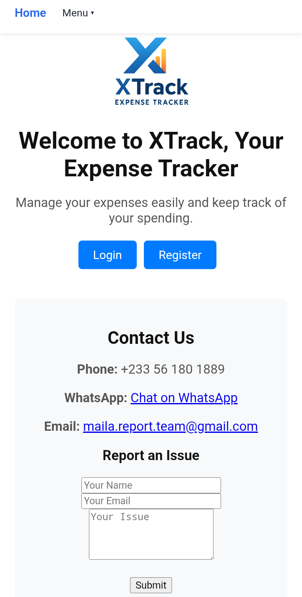

### Register / Login
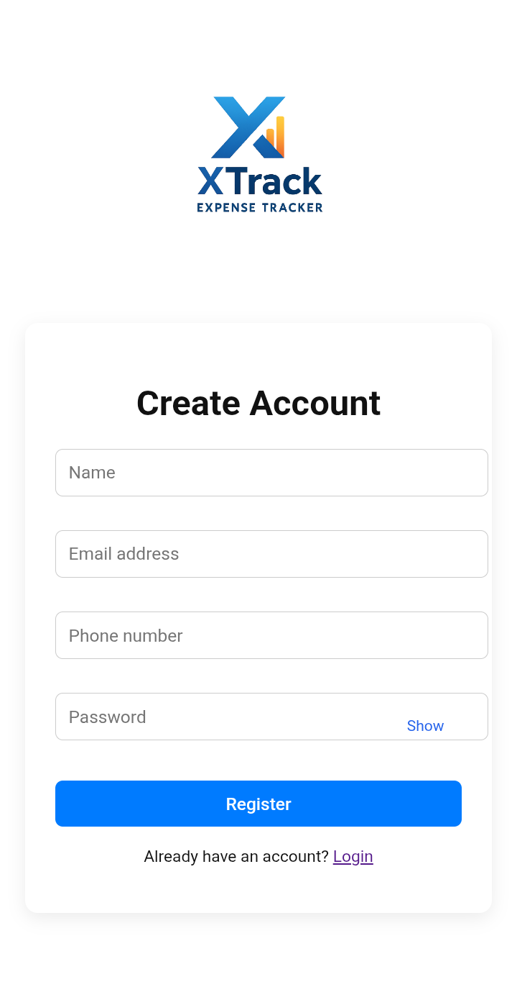
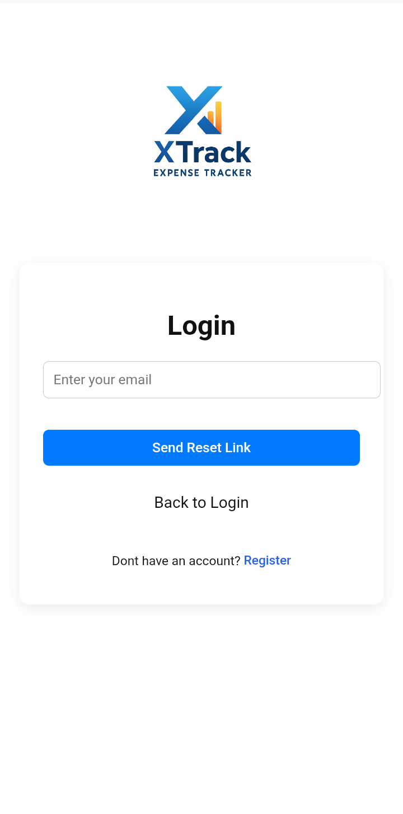

### Dashboard
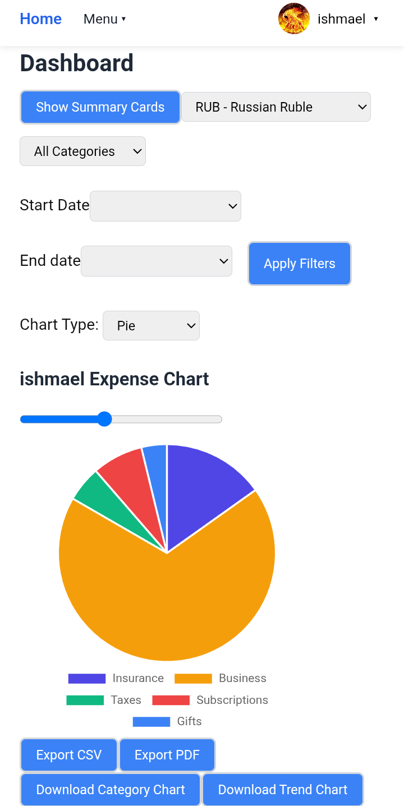
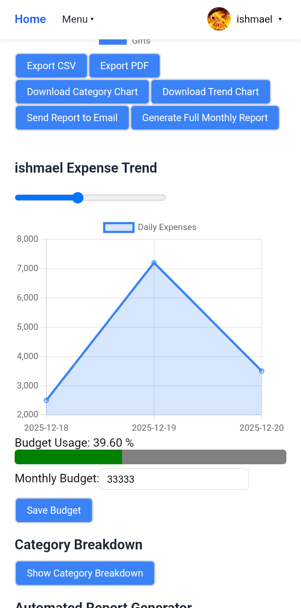

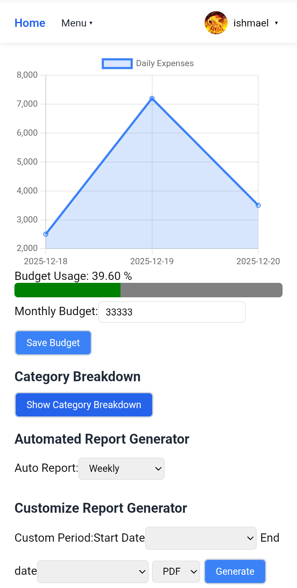

### Add / Edit Expense
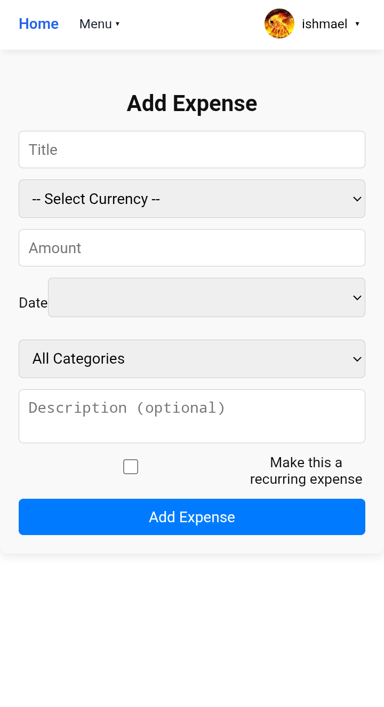
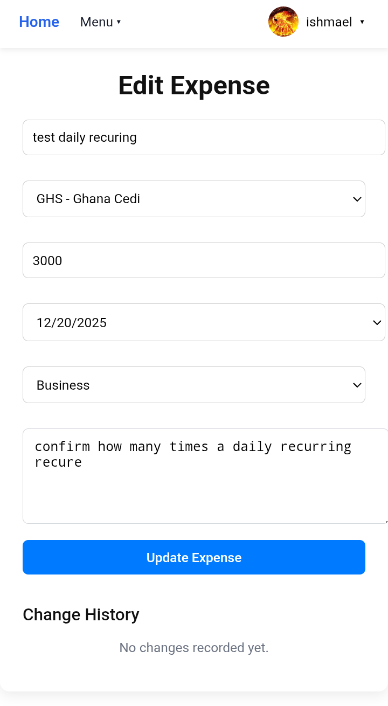
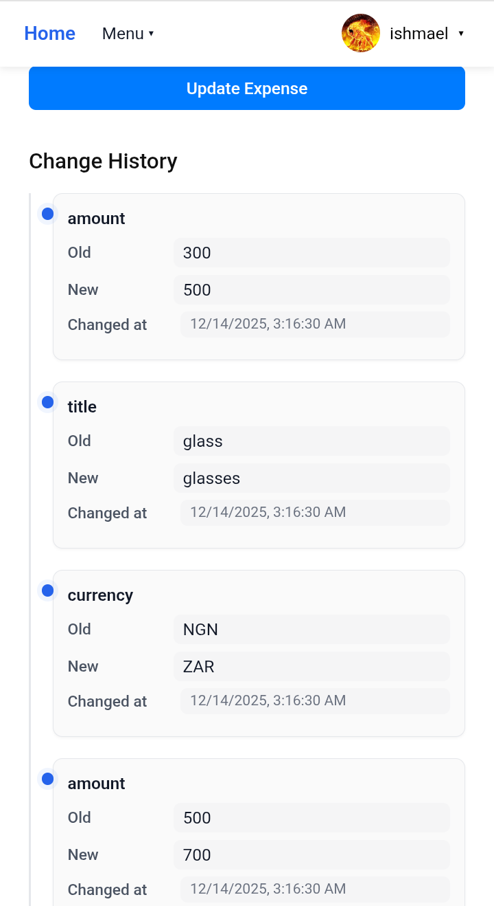

### Other Views
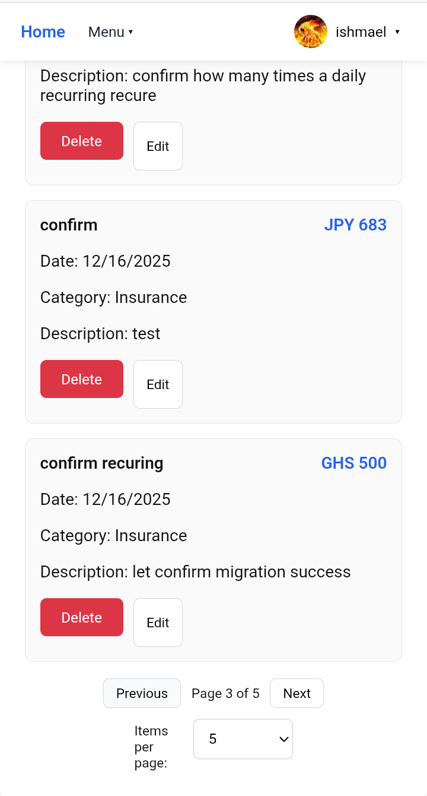
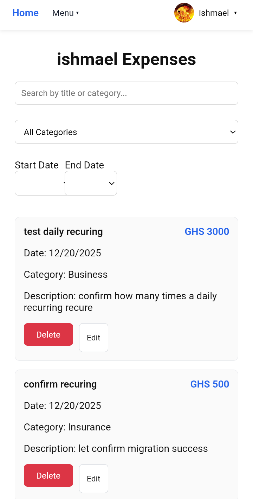
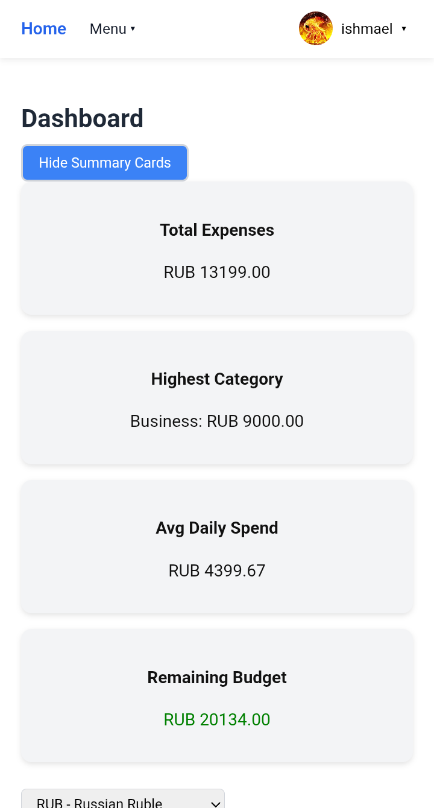

### Profile / Settings
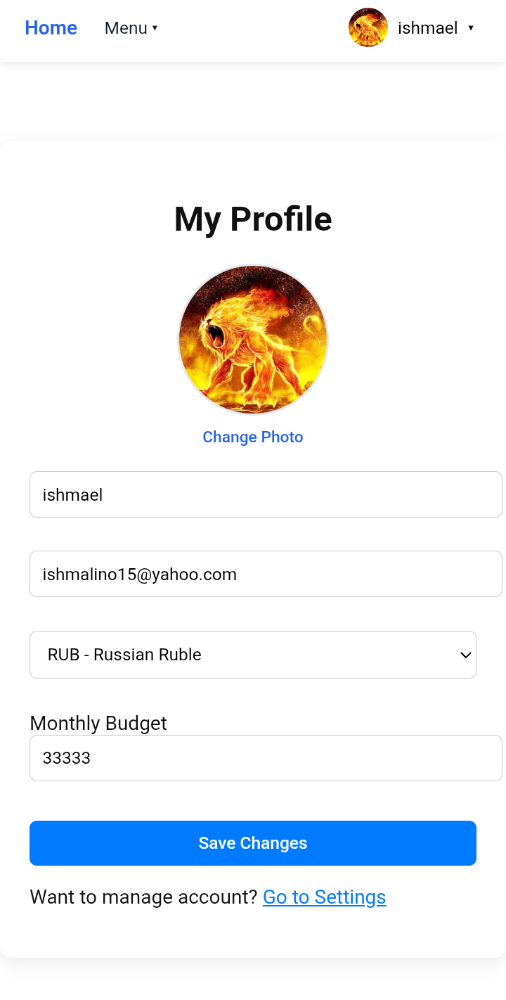
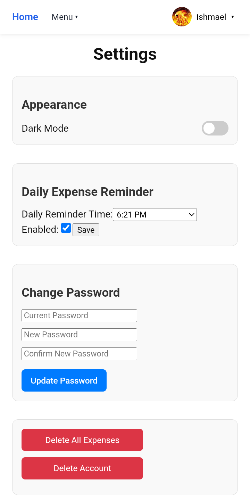

---

## Getting Started

### Prerequisites

- Node.js (v14 or higher recommended)
- npm (comes with Node.js)
- Backend server running (Flask) [link to backend repo](git@github.com:nii-larte/XTrack-backend.git)

### Installation

1. Clone the repository:
git clone git@github.com:nii-larte/XTrack-frontend.git
cd xtrack-frontend
npm install

2. Create a `.env` file in the dir and add required environment variables:
REACT_APP_API_URL=http://127.0.0.1:5000
# add any variable as specified by [Home.js]

## Running Locally

Start the development server with:
npm start

Open [http://localhost:3000](http://localhost:3000) in your browser to view the app. Make sure backend Flask server is running first.

## Running Tests

Run the test suite with:
npm test

## Build for Production

Create an optimized production build with:
npm run build

This will generate the build folder ready for deployment.

## Deployment 

You can deploy your React frontend using free hosting services:

- **Netlify**
  - Connect GitHub repository and deploy automatically
  - Supports continuous deployment and automatic HTTPS

- **Vercel**
  - Import GitHub repository
  - Automatic React build and deployment
  - Continuous deployment included

- **GitHub Pages**
  - Suitable for static builds
  - Requires `HashRouter` instead of `BrowserRouter` for React Router
  - Deploy from the `build/` directory

---

## Contribution

Contributions are welcome! To contribute:

1. Fork the repository

2. Create a new branch:
git checkout -b feature/Feature

3. Make your changes in this branch

4. Commit your changes:
git commit -m "Add some feature"

5. Push to the branch:

git push origin feature/Feature

6. Open a pull request

## License

This project is licensed under the MIT License. See the [LICENSE](LICENSE) file for details.

---

## Learn More

- [React Documentation](https://reactjs.org/)
- [Create React App Documentation](https://facebook.github.io/create-react-app/docs/getting-started)
- [Axios Documentation](https://axios-http.com/)

